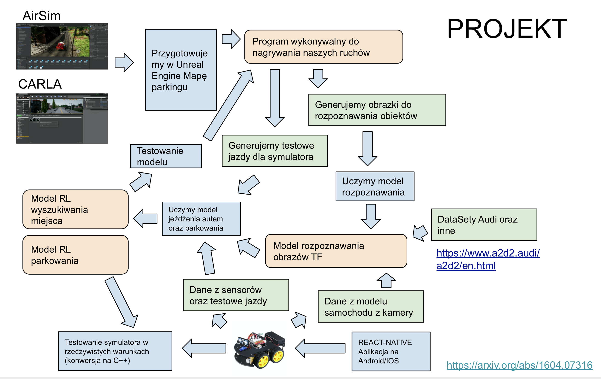

#  DW POZNAN PROJEKT 02 - AUTONOMICZNY SAMOCHÓD

Witamy na stronie projektu autonomicznego samochodu :) W ramach jego będziemy się zajmować tworzeniem pojazdu atuonomicznego do naszego projektu. Głównym celem naszego projektu jest stworzenie samoochodu który będzie za pomoą aplikacji na Android/iOS znajdował miejsce parkingowe i parkował bez udzialu kierowcy przy pomocy algorytmów sztucznej inteligencji.

Za samochód posłuży nam samochód ELEGOO Smart Robot CAR który zostaniie rozszerzony o kamerę i modół Rasspery PI. 

### Struktura projektu

### Struktura katalogów

* `models` - wyeksportowane modele 
* `engine` - źródła dla engine do tworzenia map parkingu. symuluowaniia parkingu.
* `dataset` - lista danych do uczeania 
* `mobile` - folder ze źrodłami do mobilnej aplikacji
* `auto` - Pliki źródłowego dla rzezcywistego pojazdu
* `carparking` - Pliki źródłowe do uczenia modelu samochu (Python)

### Czas Trwania i potrzebne osoby

Projekt rozpoczął się w lipcu 2020 roku i potrwa kilka miesięcy. Sam projekt autonomicznego pojazdu wymaga wielu modułów, dlatego każdy który chce wziąć udział w projekcie może się zgłosić. W ramach projektu będziemy potrzebowali głównie do

* Tworzenie zbiorów testowych
* Tworzenie map parkingu w Unreal Engine (`AirSim`)
* Tworzenie model AI  rozpoznawania obrazów
* Tworzenie modelu AI reinforcement learning do parkowania
* Tworzenie modelu AI reinforcement learnng do trzymania i reagowania podczas zwykłego jedzenia.
* Tworzenie algorytmu AI do wyszukiwania miejsca parkingowego
* Programowanie w ReactNative modułu do parkowaniia
* Tworrzenie serwera WiFi do udostępnienia informacji o trasie dla samochodu

### Spotkania

Spotkania odbywają się regularnie o 2 tygodnie gdzie przedstawiamy kolejne kroki w naszym projekcie. 

* `2020-07-09` - https://github.com/dataworkshop/dw-poznan-project/tree/master/spotkania/2020-07-09 . Przedstawienie samohodu autonomicznego.
* `2020-07-23` - https://github.com/dataworkshop/dw-poznan-project/tree/master/spotkania/2020-07-23 - Omówienie symulatorów do uczenia maszynowego.

### Czym jest DW POZNAN ?

Jeseśmy grupą pasjonatów sztuzcnej inteligencji. W jej ramah ustalamy regularne spotkania i uzcestniczymy w ciekawych projektach. Każdy bez względu na poziom mże wziąć udział w projekcie i nauczyć się czegoś ciekawego :) 