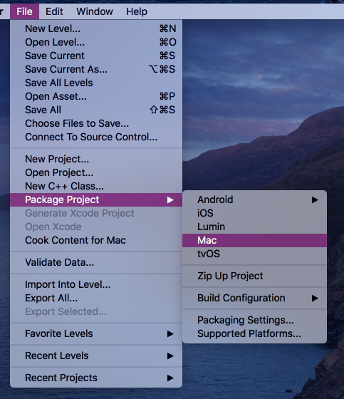

# AUTO

Pliki źródłowe dla rzeczywistego pojazd. Pierwsza wersja zawiera tylko podstawowe funkcjonalności. W katalogu Release znajdują się wersje na poszczególne systemy.

* Jeżdzenie po parkingu

## Kompilacja

Aby przekompilować projekt potrzebujesz Unreal Engine 4.23 / 4.24 którego można pobrać z tąd.

https://www.unrealengine.com/en-US/get-now

Kompilacja wystarczy uruchomić projekt i kliknąć File/Package Project oraz wybrać docelowy system operacyjny

